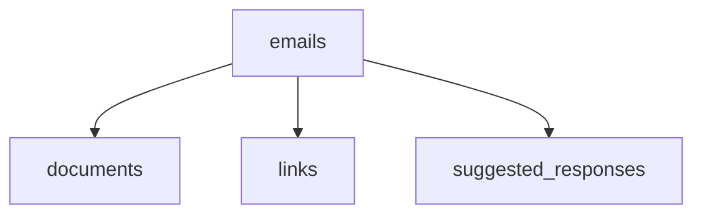

# Email Moderation System

A Laravel‑based email moderation system that fetches emails from Gmail via IMAP,
stores them in PostgreSQL (using JSONB for flexible data), processes them with
an AI model (Ollama + phi), and manages suggested responses. The system runs
entirely in Docker containers and uses scheduled jobs for automated moderation.

## Table of Contents

- [Overview](#overview)
- [Architecture](#architecture)
- [Prerequisites](#prerequisites)
- [Installation](#installation)
- [Environment Configuration](#environment-configuration)
- [Database Schema](#database-schema)
- [Scheduled Jobs](#scheduled-jobs)
- [AI Moderation](#ai-moderation)
- [API Endpoints](#api-endpoints)

## Overview

This system connects to a Gmail inbox, imports new emails, and runs them through
an AI moderation pipeline. Based on the analysis, it can generate suggested
replies and store all data in a structured yet flexible PostgreSQL database. The
entire application is containerised with Docker, making it easy to deploy and
scale.

## Architecture

- **Laravel** – PHP framework for the application logic.
- **PostgreSQL** – Relational database with JSONB columns for semi‑structured
  data.
- **Docker** – Containers for the app, web server, database, and Ollama.
- **Gmail IMAP** – Protocol to fetch emails.
- **Ollama** – AI service running the `phi` model for content analysis.
- **Scheduled Jobs** – Laravel scheduler manages fetching, moderation, and retry
  jobs.

## Prerequisites

- Docker and Docker Compose (≥ v2.0)
- Git
- A Gmail account with
  [IMAP enabled](https://support.google.com/mail/answer/7126229) and an
  [App Password](https://support.google.com/accounts/answer/185833) generated.
- (Optional) PHP 8.1+ and Composer for local development.

### Gmail Setup

1. **Enable 2‑Step Verification**\
   Go to [Google Account Security](https://myaccount.google.com/security) and
   turn on **2‑Step Verification**.

2. **Generate an App Password**
   - Visit [App Passwords](https://myaccount.google.com/apppasswords).
   - Select **Mail** as the app and **Other** as the device (e.g., “Email
     Moderation App”).
   - Click **Generate** – you will receive a 16‑character password like
     `qlgg rlky mqij jgok`.
   - Copy this password – you will use it as the `IMAP_PASSWORD` in your `.env`
     file.

3. **Enable IMAP in Gmail**
   - Open Gmail settings → **See all settings** → **Forwarding and POP/IMAP**.
   - In the **IMAP Access** section, select **Enable IMAP**.
   - Save changes.

## Installation

1. Clone the repository:
   ```bash
   git clone https://github.com/YOUR_USERNAME/email-moderation.git
   cd email-moderation
   docker-compose up --build
   php artisan migrate
   php artisan queue:work
   ```

## Database Structure

The system uses PostgreSQL with JSONB document storage and relational links
between emails and AI-generated responses.



## Documentation

Detailed project documentation is available in the [`docs/`](docs/) folder.

- **architecture.md** — system architecture, job pipeline, and controller
  structure
- **database.md** — full database schema, tables, and relationships
- **future_planning.md** — planned improvements and roadmap

Open the files in the `docs/` folder for detailed information about the project.

```
```

```
```
